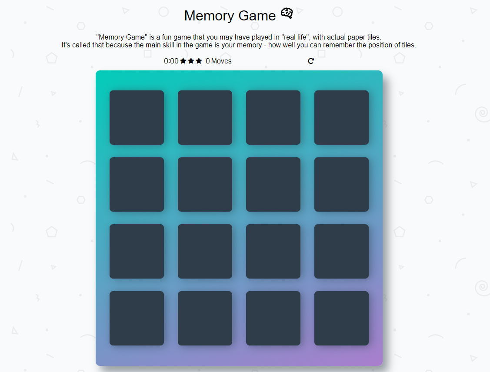

# MemoryGame
"Memory Game" is a fun game that you may have played in "real life", with actual paper tiles. It's called that because the main skill in the game is your memory - how well you can remember the position of tiles. 

## Have Fun 
https://turkialmalki.github.io/MemoryGame/

